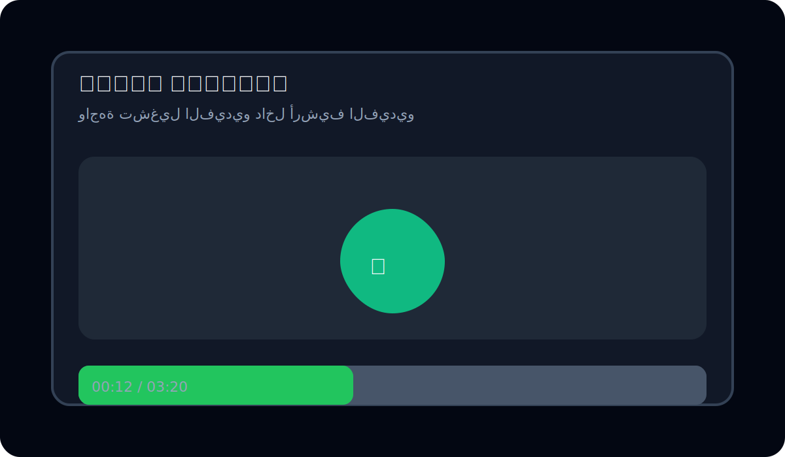

# أرشيف الفيديو

أرشيف فيديو بسيط ومحمول مبني باستخدام Vite، مُصمم لحفظ وتشغيل مجموعة من ملفات الفيديو محليًا داخل واجهة واحدة. المشروع مُهيأ للبناء كملف HTML واحد (single-file) باستخدام `vite-plugin-singlefile`، مما يجعل النشر بسيطًا ومناسبًا لمواقع ثابتة أو توزيعات محلية.

## الميزات

- واجهة خفيفة لعرض وتشغيل فيديوهات محفوظة محليًا.
- يعمل كحزمة واحدة بعد البناء (`dist/index.html`) — يحتوي الملف على كل الـ JS وCSS مُضمّنًا.
- يدعم ثيمات مبدئية ويمكن تهيئتها عبر `src/theme/`.
- بنية مشروع منظمة تُسهّل فصل منطق التشغيل، الواجهة، والأنماط.

## لقطات شاشة


**لقطة 1:** صفحة الأرشيف الرئيسية حيث يمكن اختيار الفيديو وتشغيله.



**لقطة 2:** شاشة تشغيل الفيديو مع شريط تقدم التشغيل.

## المتطلبات

- Node.js 16+ و npm

## التشغيل محليًا (بيئة تطوير)

```bash
npm install
npm run dev
```

ثم افتح المتصفح على العنوان الذي يعرضه Vite (افتراضياً `http://127.0.0.1:5173/`).

## البناء للنشر

```bash
npm run build
```

بعد البناء ستجد ملفًا واحدًا مُجمَّعًا في `dist/index.html` يحتوي на التطبيق كاملاً (JS وCSS مضمّنين) — مناسب للرفع كموقع ثابت أو للاستخدام محليًا كنسخة واحدة.

## بنية المشروع

```
index.html
README.md
package.json
src/
  main.js                  # مدخل التطبيق
  app/
    startVideoArchive.js   # واجهة بدء الأرشيف وتهيئته
  runtime/
    videoArchiveRuntime.js # منطق تشغيل الفيديو والأرشفة
  styles/
    generated-tailwind.css # أنماط مُدمجة/منشأة
    app-overrides.css      # تعديلات على الأنماط
  theme/
    applyInitialTheme.js   # تطبيق الثيم عند التحميل
    themeStorage.js        # تخزين تفضيلات الثيم
```

## التخصيص

- لتغيير سلوك التشغيل أو استيراد فيديوهات جديدة، عدِّل الملفات داخل `src/runtime/` و `src/app/`.
- لتعديل الأنماط، عدِّل `src/styles/app-overrides.css` أو أعد توليد `generated-tailwind.css` حسب إعداداتك.

## نشر إلى GitHub Pages أو مضيف ملفات ثابت

1. `npm run build`
2. ارفع محتويات مجلد `dist/` إلى مضيف الملفات الثابتة أو إلى GitHub Pages.

## المساهمة

إذا رغبت بالمساهمة: افتح Issue أو قدم Pull Request يوضح التعديل والغرض.

## الترخيص

هذا المشروع مرخَّص بموجب ترخيص MIT.

----

تم الآن إضافة:
- ملف `CONTRIBUTING.md` للإرشادات.
- GitHub Actions workflow لنشر `dist/` تلقائيًا إلى GitHub Pages بعد كل دفع إلى `main`.
